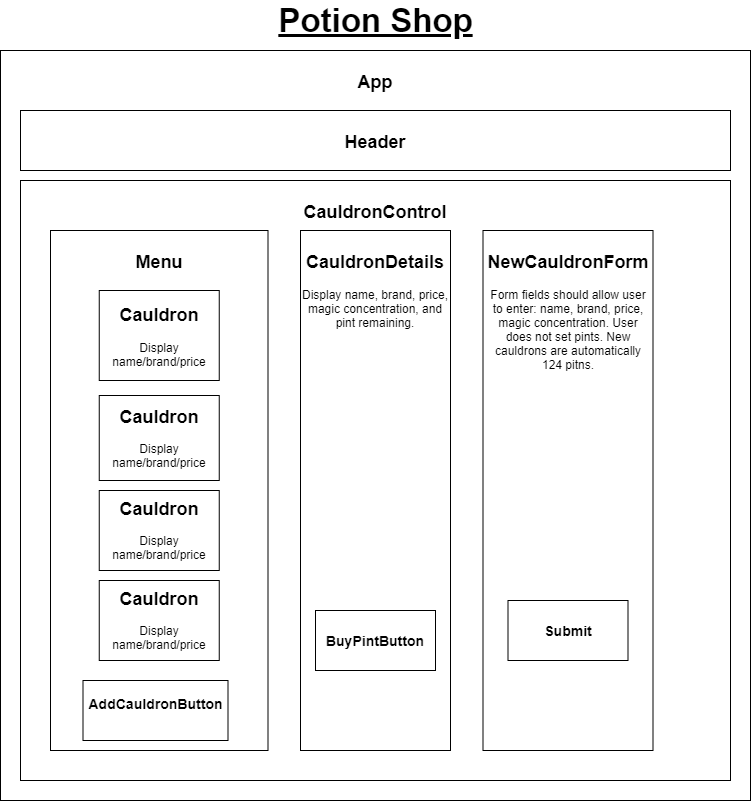

# Potion Shop
#### Learning project for Epicodus - Website made with React
#### By Shanen Cross

## Project Description
A "potion shop" that keeps track of the "cauldrons" from which potion drinks are sold. Built with React, using both local and shared state.

The shop fulfills the following user stories:
* As a user, I want to see a list/menu of all available cauldrons. For each cauldron, I want to see its name, brand, price, description, and "magic concentration".
* As a user, I want to submit a form to add a new cauldron to a list.
* As a user, I want to be able to click on a cauldron to see its detail page.
* As a user, I want to see how many pints are left in a cauldron. A full cauldron has 124 pints.
* As a user, I want to be able to click a button next to a cauldron whenever I sell a pint of it. This should decrease the number of pints left by 1. Pints should not be able to go below 0.

## Technologies Used
* HTML
* CSS
* JavaScript
* React

## Set up / Installation requirements

### Installing Prerequisites
* Install git
* Install [npm](https://www.npmjs.com/), the JavaScript package manager. For development, I used npm version 6.14.10

### Installing Application
* Use ```git clone``` to download this repository to a local directory
* Navigate to this local directory in your terminal, which should be named ```potion-shop``` by default
* Enter ```npm install``` on the command line to install the necessary modules
* Enter ```npm start``` on the command line to build the project and run a local server. The website will automatically open in your web browser. By default, the URL should be _http://localhost:3000/_

# Component Diagram



## Known Bugs
* No known bugs

## License
* [MIT](LICENSE)
* Copyright 2021 Shanen Cross
